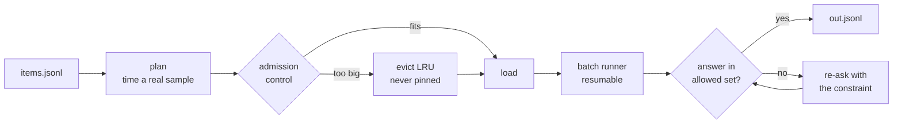

# local-llm

**A 100 GB model and a 3 GB model do not co-reside on a 128 GB machine.** Run bulk
work through LM Studio and you spend your time babysitting memory instead of doing
the work: guessing what fits, watching a load fail three-quarters of the way in,
losing an overnight job to a crash at item 3,000, and discovering afterwards that
the model quietly answered in its own categories instead of yours.

`local-llm` takes that over. It picks a model that fits the budget, evicts what it
must, resumes a batch exactly where it stopped, and constrains the output to a set
you specify — re-asking the model when it drifts.

```text
$ local-llm batch commits.jsonl --template classify.md --out out.jsonl \
    --allow feature,bugfix,refactor,docs,test,infra,release
3803/3803  ok 3803  failed 0  ETA 0s
Batch complete: 3803/3803, 3803 ok, 0 failed. Output: out.jsonl
```



It runs on Node 18+ with **no runtime dependencies**, needs LM Studio's server
running, and resolves the `lms` binary from `LMS_BIN`, `which lms`, or
`~/.lmstudio/bin/lms` in that order.

## Backends

Works with **LM Studio**, **Ollama**, or any **OpenAI-compatible** server (vLLM,
llama.cpp server, LiteLLM, a remote host). With no configuration it probes
`127.0.0.1:1234` and `127.0.0.1:11434` and registers whichever answers.

```text
$ local-llm endpoints
ID      KIND      URL                     REACHABLE  CAPABILITIES
local   lmstudio  http://127.0.0.1:1234   yes        sizes loadedState load unload embed
ollama  ollama    http://127.0.0.1:11434  yes        sizes loadedState load unload embed
```

Backends differ in what they can tell you, and the tool degrades honestly
rather than guessing:

| | LM Studio | Ollama | generic OpenAI |
|---|---|---|---|
| model sizes | yes | yes | **no** |
| loaded state | yes | yes | **no** |
| load / unload | yes | yes (`keep_alive`) | **no** |
| memory management | full | full | **unmanaged** |

On an endpoint that cannot report sizes or loaded state, `budget` reports
`managed: false` with no usage figures, admission returns `unmanaged` and never
blocks a run, and `pin` fails loudly instead of recording something that could
never take effect. A missing size is never treated as zero — that would make an
unknown model look like the smallest and win every `reflex` selection.

Add endpoints explicitly in `~/.config/local-llm/endpoints.json`:

```json
{
  "endpoints": [
    { "id": "ollama", "kind": "ollama", "baseUrl": "http://127.0.0.1:11434" },
    { "id": "remote", "kind": "openai", "baseUrl": "https://my-vllm.example.com",
      "apiKeyEnv": "MY_VLLM_KEY" }
  ]
}
```

An API key is read from the named environment variable, never stored in the file.
Entries written before multi-backend support have no `kind` and are treated as
LM Studio, so existing configs keep working.

## Install

From this directory:

```sh
npm link
local-llm --version
```

No package install step is otherwise required.

## Commands

```text
local-llm models [--fit] [--class <c>] [--check-updates] [--json]
local-llm ps [--json]
local-llm budget [--json]
local-llm ask <prompt…> [--class c] [--model m] [--uncensored] [--json]
local-llm batch <items.jsonl> (--template f | --prompt s) [--out f]
    [--class c] [--model m] [--field name] [--system f]
    [--concurrency n] [--allow a,b,c] [--restart] [--dry-run] [--json]
local-llm plan <items.jsonl> (--template f | --prompt s)
    [--class c] [--model m] [--field name] [--json]
local-llm bench [--model m] [--class c] [--json]
local-llm load <model> [--dry-run] [--json]
local-llm unload <identifier | --all> [--json]
local-llm pin <model>
local-llm unpin <model>
local-llm pins
```

Every command accepts `--endpoint <id>` and `--json`. Without an endpoint
registry, the default is the local LM Studio server. Additional endpoints can
be registered in `~/.config/local-llm/endpoints.json`:

```json
{
  "default": "local",
  "endpoints": [
    {
      "id": "local",
      "label": "LM Studio (this Mac)",
      "baseUrl": "http://127.0.0.1:1234",
      "apiKey": null,
      "control": "cli",
      "capacityGb": null
    }
  ]
}
```

`control` can be `cli`, `jit`, or `none`. Only `cli` endpoints can be
explicitly loaded or evicted.

`local-llm models --check-updates` asks the HuggingFace API which
text-generation models (GGUF and MLX) are currently popular, keeps only the
ones that fit this machine's memory budget — picking the largest quantisation
that fits when a repo publishes several — and flags newer quantisations of
models already installed. The output is labelled "new and trending, ranked by
downloads — not a quality judgement": popularity is not quality, and the tool
does not claim otherwise. Results are cached for 24h in
`~/.cache/local-llm/updates.json`, and any network failure degrades to a
one-line message with exit code 0.

## Worked batch example

Create `reviews.jsonl`:

```jsonl
{"id":"review-001","title":"A practical keyboard","body":"Solid and quiet."}
{"id":"review-002","title":"A noisy mouse","body":"Good tracking, loud clicks."}
```

Create `classify.txt`:

```text
Classify this review as positive, mixed, or negative.
Title: {{title}}
Review: {{body}}
Return only the label.
```

Run it:

```sh
local-llm batch reviews.jsonl \
  --template classify.txt \
  --class workhorse \
  --out reviews.out.jsonl
```

The output is appended and flushed after every item:

```jsonl
{"i":0,"id":"review-001","ok":true,"response":"positive","usage":{"prompt_tokens":31,"completion_tokens":1,"total_tokens":32},"ms":412,"error":null}
```

If the process or machine stops, run the same command again. Existing ids in
`reviews.out.jsonl` are skipped. `--restart` intentionally discards that resume
state and starts a fresh output file. A failed request is retried twice (after
1 second and 4 seconds); a permanently failing item is recorded with
`"ok":false`, and the other items continue.

The loaded model's LM Studio `PARALLEL` value sets the default worker count,
with a fallback of 4. Use `--concurrency N` to override it. On `Ctrl-C`, no new
items are scheduled, active requests finish, and the command exits with status
130 after printing the exact output path to resume.

For a plain-text input file, wrap each line in a named template field:

```sh
local-llm batch notes.txt \
  --field text \
  --prompt 'Summarize: {{text}}' \
  --out notes.out.jsonl
```

Use `--system path/to/system.txt` for a system message. If the argument does
not name a file, it is treated as literal system text. Use `--dry-run` to
validate input and show the admission plan without loading, unloading, or
creating output.

For constrained classification jobs, `--allow a,b,c` restricts the answer to
an exact set of values. A reply that is not in the set is retried with the
constraint restated; a reply that recovers unambiguously (e.g. `**positive**`
or "The label is positive") is canonicalised to the permitted value and the
raw text is kept in a `raw` field. Genuinely ambiguous replies are recorded as
failures rather than silently guessed.

## Estimating and benchmarking

`local-llm plan` estimates a batch before you run it: item count, tokens per
item, total tokens, and an ETA. By default it times a real end-to-end sample
of the actual job — 8 items (`--sample N` to change) rendered through the
template and run through the same code path as the batch, with the same
concurrency, `--allow` constrained-output retries, and reasoning effort —
because short requests are dominated by fixed per-request overhead that no
token-rate model captures. The same sample also measures prompt and completion
tokens per item from the API's reported usage. Every figure is labelled by its
basis — measured or assumed:

```sh
local-llm plan reviews.jsonl --template classify.txt --class workhorse
```

With `--no-sample` (or if the sample fails, in which case plan falls back
gracefully), the ETA comes from token rates instead — less accurate, and
labelled as such: first separate prefill/decode rates (seconds/item = prompt
tokens ÷ prefill rate + completion tokens ÷ decode rate, divided by
concurrency), then the measured aggregate tok/s from
`~/.local/state/local-llm/throughput.json`, and finally a clearly labelled
default. The method used is stated in the output. Prompt and completion tokens
have very different throughput — prefill is compute-bound and fast, decode
memory-bandwidth-bound and slow — so billing both at one rate over-estimates
prompt-heavy jobs badly. Note that any end-to-end item rate
(`itemsCompleted / wallClockSeconds`) already includes the effect of
concurrency; an ETA must never divide by the slot count again. bench's own
items/s figure is deliberately never used for the ETA: it is measured on
bench's long-generation prompt and does not transfer to other tasks.

`local-llm bench` produces those measured rates. It times the model load,
measures single-stream tok/s, measures the concurrent aggregate tok/s
across the model's advertised `PARALLEL` slots, times prefill separately with
a long prompt and tiny generation budget, and records all of them plus an
end-to-end items/s figure in the throughput cache:

```sh
local-llm bench --model qwen3-coder-next
```

The aggregate is measured directly, never estimated as
`single-stream rate × slots`: concurrency scales sub-linearly on Apple unified
memory because inference is memory-bandwidth-bound, not compute-bound (on one
M5 Max, 4 slots bought ~1.5×, not 4×). Multiplying the single-stream rate by
the slot count would overstate throughput several-fold.

## Memory budget and admission

The limiting resource is unified memory, not a token quota. `local-llm`
calculates:

```text
inference budget = GPU wired-memory ceiling - OS/app reserve
free budget      = inference budget - sizes of loaded models
```

The wired-memory ceiling is platform-specific:

| host | ceiling source |
|---|---|
| macOS (Apple Silicon) | `sysctl -n iogpu.wired_limit_mb`; `0` (unset) → 75% of unified memory |
| Linux / Windows + NVIDIA | total VRAM from `nvidia-smi --query-gpu=memory.total` |
| anything else / detection fails | 60% of system RAM, clearly labelled a fallback |

`local-llm budget` prints which source produced the number, so on an
unsupported host you can see why it is what it is. Override it with
`LOCAL_LLM_CEILING_GB` / `LOCAL_LLM_RESERVE_GB` or place the following in
`~/.config/local-llm/config.json`:

```json
{"ceilingGb":90,"reserveGb":16}
```

When a requested model does not fit, the tool evicts loaded models from the
least recently used upward until enough memory is free. State is kept in
`~/.local/state/local-llm/lru.json`. Models listed in
`~/.config/local-llm/pins.json` are never automatically evicted; manage that
list with `local-llm pin`, `unpin`, and `pins`. Explicit `unload` remains under
the operator's control.

A model larger than the entire inference budget is rejected before any
eviction. The error reports the `iogpu.wired_limit_mb` value required to admit
it. Inspect the calculation with `local-llm budget` and preview admission with
`local-llm load <model> --dry-run`.

## Model classes

The default batch class is `workhorse`. Other classes are `reflex`, `coder`,
`heavy`, `vision`, `embed`, and `security`.

Selection is **capability-based over whatever the endpoint reports** — there
are deliberately no hardcoded model ids, so the tool works on any machine with
any set of installed models. Each class applies hard filters (model type,
`tool_use` capability when required, fits the memory budget), then a size
preference (reflex prefers the smallest viable, heavy the largest admissible,
workhorse the largest under ~40% of budget), then weak pattern-based family
hints to break ties. Classes fall back to a smaller general-purpose class when
nothing fits, and return a clear "no model fits this class" error rather than
a silent wrong answer when nothing works at all. Override any class with
`~/.config/local-llm/classes.json`, e.g. `{"workhorse": ["my-model"]}`.

The `security` class contains abliterated or uncensored models (detected by
pattern among your own installed models) and is never auto-selected. It
requires an explicit `--class security` or `--uncensored`. These models trade
instruction-following and factual accuracy for the absence of refusals. They
are a remedy for false refusals on systems you own or are authorised to test,
not a general-purpose model choice.

## Privacy

`local-llm` reads your local files (the input JSONL, templates, and its own
config and state under `~/.config/local-llm` and `~/.local/state/local-llm`).
It sends prompts only to the endpoint you configure — by default the LM
Studio server on `127.0.0.1` — and makes no other network calls. It never
transmits credentials.

## Tests

```sh
npm test
```

Tests use injected clients and temporary state. They do not contact a network
endpoint or execute the real `lms` binary.
